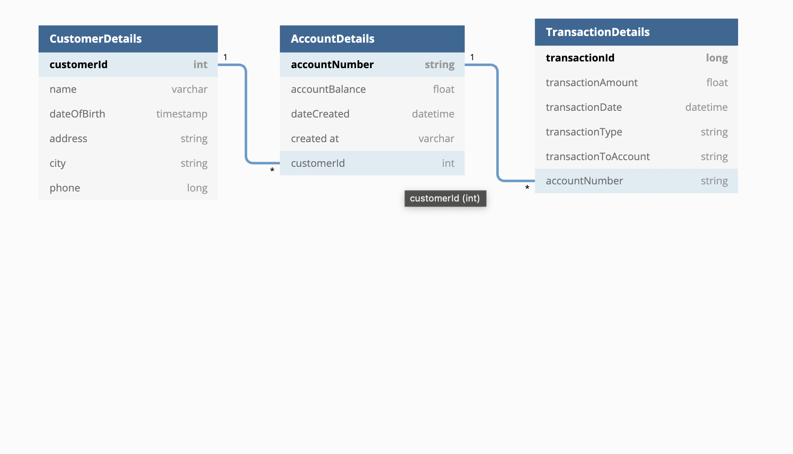

# Online-banking

### Tools used :
- Intellij IDEA 
- Postman
- Swagger

### Introduction :
A basic banking application, created POJOs for Customers, Accounts and Transactions.
Performed basic CRUD operations on the above and implemented a TransferMoney service

### Schema Details :
Database used : H2 database

### Key Implementations :
- Created a Springboot application using gradle from Spring Initializr - https://start.spring.io
- Created POJOs for Customers, Accounts and Transactions.
- Implemented a Controller, Service, Repository layered architecture
- Implemented relationships between the entities as :
  - One customer can have more than one accounts
  - One account can have more than one associated transactions
- Performed basic CRUD operations on the above and implemented a TransferMoney service
- Tested urls using Postman and swagger

### Personal takeaways from implementations :
- Learned about Layered architecture
- Learned that can use services of other classes for implemenation as long as layer sequence is maintained
- Preferable to call service over repository of other classes if required
- Learned about autowiring
- Learned about OrphanRemoval feature of relationships
  - Created own delete services for child entities earlier
  - Learned about @JSONManagedReference and @JSONBackReference annotations as infinite json objects were created earlier
- Learned about RequestBody and path parameters

### Logic gaps :
- How can one transaction be associated with both the 'To' and 'From' accounts during TransferMoney operation (with same transaction id)?
- How to handle the intermediate attributes formed during joining ?
- Custom exceptions didnt work, try again!

